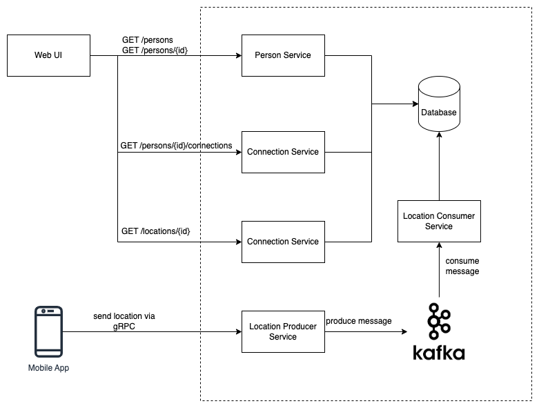

# UdaConnect
## Overview
### Background
Conferences and conventions are hotspots for making connections. Professionals in attendance often share the same interests and can make valuable business and personal connections with one another. At the same time, these events draw a large crowd and it's often hard to make these connections in the midst of all of these events' excitement and energy. To help attendees make connections, we are building the infrastructure for a service that can inform attendees if they have attended the same booths and presentations at an event.

### Technologies
* [Flask](https://flask.palletsprojects.com/en/1.1.x/) - API webserver
* [SQLAlchemy](https://www.sqlalchemy.org/) - Database ORM
* [PostgreSQL](https://www.postgresql.org/) - Relational database
* [PostGIS](https://postgis.net/) - Spatial plug-in for PostgreSQL enabling geographic queries]
* [Kafka](https://kafka.apache.org/) - Distributed event streaming platform
* [Vagrant](https://www.vagrantup.com/) - Tool for managing virtual deployed environments
* [VirtualBox](https://www.virtualbox.org/) - Hypervisor allowing you to run multiple operating systems
* [K3s](https://k3s.io/) - Lightweight distribution of K8s to easily develop against a local cluster
* [Helm](https://helm.sh/) - The package manager for Kubernetes

## Running the app
The project has been set up such that you should be able to have the project up and running with Kubernetes.

### Prerequisites
We will be installing the tools that we'll need to use for getting our environment set up properly.
1. [Install Docker](https://docs.docker.com/get-docker/)
2. [Set up a DockerHub account](https://hub.docker.com/)
3. [Set up `kubectl`](https://rancher.com/docs/rancher/v2.x/en/cluster-admin/cluster-access/kubectl/)
4. [Install VirtualBox](https://www.virtualbox.org/wiki/Downloads) with at least version 6.0
5. [Install Vagrant](https://www.vagrantup.com/docs/installation) with at least version 2.0
6. [Install Helm](https://helm.sh/docs/intro/install/)

### Environment Setup
To run the application, you will need a K8s cluster running locally and to interface with it via `kubectl`. We will be using Vagrant with VirtualBox to run K3s.

#### Initialize K3s
In this project's root, run `vagrant up`.
```bash
$ vagrant up
```
The command will take a while and will leverage VirtualBox to load an [openSUSE](https://www.opensuse.org/) OS and automatically install [K3s](https://k3s.io/). When we are taking a break from development, we can run `vagrant suspend` to conserve some ouf our system's resources and `vagrant resume` when we want to bring our resources back up. Some useful vagrant commands can be found in [this cheatsheet](https://gist.github.com/wpscholar/a49594e2e2b918f4d0c4).

#### Set up `kubectl`
After `vagrant up` is done, you will SSH into the Vagrant environment and retrieve the Kubernetes config file used by `kubectl`. We want to copy the contents of this file into our local environment so that `kubectl` knows how to communicate with the K3s cluster.
```bash
$ vagrant ssh
```
You will now be connected inside of the virtual OS. Run `sudo cat /etc/rancher/k3s/k3s.yaml` to print out the contents of the file. You should see output similar to the one that I've shown below. Note that the output below is just for your reference: every configuration is unique and you should _NOT_ copy the output I have below.

Copy the contents from the output issued from your own command into your clipboard -- we will be pasting it somewhere soon!
```bash
$ sudo cat /etc/rancher/k3s/k3s.yaml

apiVersion: v1
clusters:
- cluster:
    certificate-authority-data: LS0tLS1CRUdJTiBDRVJUSUZJQ0FURS0tLS0tCk1JSUJWekNCL3FBREFnRUNBZ0VBTUFvR0NDcUdTTTQ5QkFNQ01DTXhJVEFmQmdOVkJBTU1HR3N6Y3kxelpYSjIKWlhJdFkyRkFNVFU1T1RrNE9EYzFNekFlRncweU1EQTVNVE13T1RFNU1UTmFGdzB6TURBNU1URXdPVEU1TVROYQpNQ014SVRBZkJnTlZCQU1NR0dzemN5MXpaWEoyWlhJdFkyRkFNVFU1T1RrNE9EYzFNekJaTUJNR0J5cUdTTTQ5CkFnRUdDQ3FHU000OUF3RUhBMElBQk9rc2IvV1FEVVVXczJacUlJWlF4alN2MHFseE9rZXdvRWdBMGtSN2gzZHEKUzFhRjN3L3pnZ0FNNEZNOU1jbFBSMW1sNXZINUVsZUFOV0VTQWRZUnhJeWpJekFoTUE0R0ExVWREd0VCL3dRRQpBd0lDcERBUEJnTlZIUk1CQWY4RUJUQURBUUgvTUFvR0NDcUdTTTQ5QkFNQ0EwZ0FNRVVDSVFERjczbWZ4YXBwCmZNS2RnMTF1dCswd3BXcWQvMk5pWE9HL0RvZUo0SnpOYlFJZ1JPcnlvRXMrMnFKUkZ5WC8xQmIydnoyZXpwOHkKZ1dKMkxNYUxrMGJzNXcwPQotLS0tLUVORCBDRVJUSUZJQ0FURS0tLS0tCg==
    server: https://127.0.0.1:6443
  name: default
contexts:
- context:
    cluster: default
    user: default
  name: default
current-context: default
kind: Config
preferences: {}
users:
- name: default
  user:
    password: 485084ed2cc05d84494d5893160836c9
    username: admin
```
Type `exit` to exit the virtual OS and you will find yourself back in your computer's session. Create the file (or replace if it already exists) `~/.kube/config` and paste the contents of the `k3s.yaml` output here.

Afterwards, you can test that `kubectl` works by running a command like `kubectl describe services`. It should not return any errors.

### Steps
1. `kubectl apply -f deployment/db-configmap.yaml` - Set up database environment variables for the pods
2. `kubectl apply -f deployment/kafka-configmap.yaml` - Set up Kafka environment variables for the pods
2. `kubectl apply -f deployment/db-secret.yaml` - Set up secrets for the pods
3. `kubectl apply -f deployment/postgres.yaml` - Set up a Postgres database running PostGIS
4. `kubectl apply -f deployment/udaconnect-connection-api.yaml` - Set up the service and deployment for Connection API microservice
5. `kubectl apply -f deployment/udaconnect-location-api.yaml` - Set up the service and deployment for Location API microservice
6. `kubectl apply -f deployment/udaconnect-connection-api.yaml` - Set up the service and deployment for Person API microservice
7. `kubectl apply -f deployment/udaconnect-location-producer.yaml` - Set up the service and deployment for Location producer microservice
8. `kubectl apply -f deployment/udaconnect-location-consumer.yaml` - Set up the service and deployment for Location consumer microservice
9. `kubectl apply -f deployment/udaconnect-app.yaml` - Set up the service and deployment for the web app
10. `sh scripts/run_db_command.sh <POD_NAME>` - Seed your database against the `postgres` pod for the first time. (`kubectl get pods` will give you the `POD_NAME`)
11. Setup Kafka: There are plenty ways to setup a Kafka cluster. Here we use `bitnami/kafka` Helm chart:
```
helm install udaconnect-kafka -f deployment/kafka/values.yaml oci://registry-1.docker.io/bitnamicharts/kafka
```
We can customize the configuration by changing the file `deployment/kafka/values.yaml`

### Verifying it Works
Once the project is up and running, you should be able to see 6 following deployments and services:
- `postgres`
- `udaconnect-app`
- `udaconnect-connection-api`
- `udaconnect-person-api`
- `udaconnect-location-api`
- `udaconnect-location-producer`
- `udaconnect-location-consumer`

These pages should also load on your web browser:
* `http://localhost:30001/` - OpenAPI Documentation for Person API
* `http://localhost:30001/api/` - Base path for Person API
* `http://localhost:30002/` - OpenAPI Documentation for Location API
* `http://localhost:30002/api/` - Base path for Location API
* `http://localhost:30003/` - OpenAPI Documentation for Connection API
* `http://localhost:30003/api/` - Base path for Connection API
* `http://localhost:30000/` - Frontend ReactJS Application

## Architecture


## Development
### New Services
New microservices can be created inside of the `modules/microservices` subfolder.

As a reminder, each module should have:
1. `Dockerfile`
2. Its own corresponding DockerHub repository
3. `requirements.txt` for `pip` packages

### Docker Images
`udaconnect-app` and the microservices use the following Docker images:
- `udacity/nd064-udaconnect-app`
- `hongviet119/udaconnect-connection-api`
- `hongviet119/udaconnect-person-api`
- `hongviet119/udaconnect-location-api`
- `hongviet119/udaconnect-location-producer`
- `hongviet119/udaconnect-location-consumer`

## PostgreSQL Database
The database uses a plug-in named PostGIS that supports geographic queries. It introduces `GEOMETRY` types and functions that we leverage to calculate distance between `ST_POINT`'s which represent latitude and longitude.

_You may find it helpful to be able to connect to the database_. In general, most of the database complexity is abstracted from you. The Docker container in the starter should be configured with PostGIS. Seed scripts are provided to set up the database table and some rows.
### Database Connection
While the Kubernetes service for `postgres` is running (you can use `kubectl get services` to check), you can expose the service to connect locally:
```bash
kubectl port-forward svc/postgres 5432:5432
```
This will enable you to connect to the database at `localhost`. You should then be able to connect to `postgresql://localhost:5432/geoconnections`. This is assuming you use the built-in values in the deployment config map.
### Software
To manually connect to the database, you will need software compatible with PostgreSQL.
* CLI users will find [psql](http://postgresguide.com/utilities/psql.html) to be the industry standard.
* GUI users will find [pgAdmin](https://www.pgadmin.org/) to be a popular open-source solution.